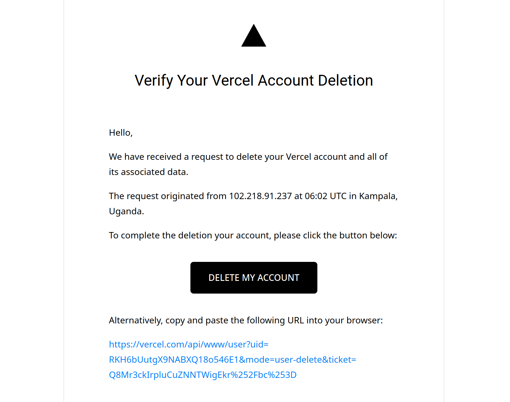

---
date:
    created: 2025-10-01
authors:
        - jod35
categories:
        - vercel
        - tech
tags:
        - tech
        - ethics
        - empathy

links:
        - index.md
        - blog/index.md
readtime: 5
comments: true
---

<iframe width="560" height="315" src="https://www.youtube.com/embed/EFwOsNF8G9o?si=XlnxdK0Ao7fzHlRi" title="YouTube video player" frameborder="0" allow="accelerometer; autoplay; clipboard-write; encrypted-media; gyroscope; picture-in-picture; web-share" referrerpolicy="strict-origin-when-cross-origin" allowfullscreen></iframe>

I'm not the most prolific frontend developer out there, but lately, I've been dipping into some frontend tasks using plain JavaScript and sometimes [VueJS](https://vuejs.org). In the past, I experimented with [ReactJS](https://react.dev) creating mobile apps with [React Native](https://reactnative.dev/).
<!-- more -->

When I was learning React, I relied on platforms like [Netlify](https://www.netlify.com/) and [Vercel](https://vercel.com/) to deploy my small-to-medium-sized projects. I'm not a full-stack developer, and honestly, I cringe when people toss that label around like it's some badge of honor.

Anyway, yesterday I was scrolling on Twitter and saw the CEO of Vercel, Guillermo Rauch, make this tweet:

<blockquote class="twitter-tweet">
🇺🇸 🇮🇱 🇦🇷  Enjoyed my discussion with PM Netanyahu on how AI education and literacy will keep our free societies ahead.  We spoke about AI empowering everyone to build software and the importance of ensuring it serves quality and progress.  Optimistic for peace, safety, and… <a href="https://t.co/zENBbRig2L">pic.twitter.com/zENBbRig2L</a>
&mdash; Guillermo Rauch (@rauchg) <a href="https://twitter.com/rauchg/status/1972669025525158031?ref_src=twsrc%5Etfw">September 29, 2025</a></blockquote>  

I felt let down. This individual serves as an inspiration to so many, but here he is posing for a photo with one of the most evil figures in leadership today. That image prompted me to boycott everything from his company. I went ahead and deleted my Vercel account following the group boycot against the company.

It is easy for us to say we are good and hold others to standards we believe are right. For me, associating with such a leader does not resonate with my values. Show me who you walk with and I'll show you your morals.

It's no secret anymore that Israel, led by Benjamin Netanyahu, is engaging in horrific acts of violence that inflict agony, hardship, and loss of life on children and civilians in Palestine.

As a result, I vow to avoid their hosting services entirely moving forward. I've also been utilizing [V0](https://v0.app), which has been quite useful, but I'll need to discontinue that as well. Regarding Next.js and other Vercel-related open-source tools, I'll continue using them since they aren't direct endorsements of the CEO's personal opinions.
Practice kindness and steer clear of aligning with or endorsing those whose principles don't align with yours. Killings whether in Africa, Asia or any part of the world are evil and anyone associating themselves with those responsible should not be endorsed.
