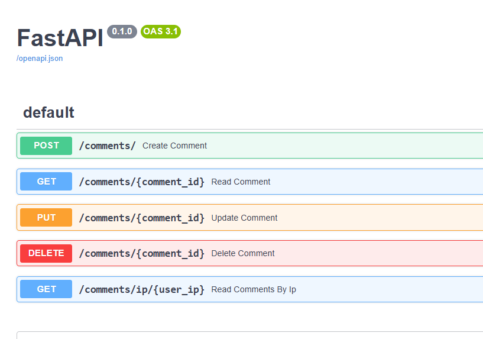

---
date:
  created: 2025-08-07
authors:
    - jod35
categories:
    - docker
    - pycon
    - fastapi
    - apis
    - pycon-uganda
tags:
    - python
    - fastapi
    - pycon

links:
    - index.md
    - blog/index.md
readtime: 5
comments: true
---

The document below is code snippets on the stuff I will present at Pycon Uganda 2025.

<iframe class="speakerdeck-iframe" frameborder="0" src="https://speakerdeck.com/player/1bd4e81a23ba4cc4bb891c35a929ee3a" title="FastAPI Beyond CRUD, Build powerful, scalable Apps With Python " allowfullscreen="true" style="border: 0px; background: padding-box padding-box rgba(0, 0, 0, 0.1); margin: 0px; padding: 0px; border-radius: 6px; box-shadow: rgba(0, 0, 0, 0.2) 0px 5px 40px; width: 100%; height: auto; aspect-ratio: 560 / 315;" data-ratio="1.7777777777777777"></iframe>

<!-- more -->
## Backend in one file

Here is a single-file simple CRUD APP Built with FastAPI and SQLModel

### Requirements

```
fastapi[all]==0.116.
pydantic-settings==2.10.
ruff==0.12.
sqlmodel==0.0.
```

### Define a database model

```python
# app.py
from sqlmodel import SQLModel , Field
from datetime import datetime

class Comment(SQLModel, table=True):
    id: Optional[int] = Field(default=None, primary_key=True)
    user_ip: str = Field(max_length= 45 , nullable=False) # Supports IPv4 and IPv
    comment_text: str = Field(nullable=False)
    created_at: datetime = Field(default_factory=datetime.now(tz=timezone.utc))
    updated_at: datetime = Field(default_factory=datetime.now(tz=timezone.utc),
    sa_column_kwargs={"onupdate": datetime.now(tz=timezone.utc)})
    __table_args__ = (
        Index("idx_talk_id", "talk_id"),
        Index("idx_user_ip", "user_ip"),
    )
```

### Create the database from the model

```python
# app.py
from sqlmodel import create_engine

# ... the model

engine = create_engine("sqlite:///comments.db")

if __name__ == "__main__":
    SQLModel.metadata.create_all(engine)
```

### Run the file

```shell
$ python3 app.py
```

### Created Database


### Create the session for CRUD

```python
from sqlmodel import Session

engine = create_engine("sqlite:///comments.db")

def get_session():
    with Session(engine) as session:
        yield session

```

### Create the Pydantic models

We need serializers and request/ response validation

```python
from sqlmodel import SQLModel, fields
# ... more imports here

# .. more code here

class Comment(SQLModel, table=True):
    id: Optional[int] = Field(default=None, primary_key=True)
# ... the rest of the fields
# we shall use this as a read schema (sqlmodel)

class CommentCreateSchema(BaseModel):
    user_ip : str = Field(max_length= 45 )
    comment_text: str

class CommentUpdateSchema(BaseModel):
    comment_text: str
```

### Then the CRUD Routes (Create the FastAPI instance)\*\*

```python
from fastapi import FastAPI

app = FastAPI(
    title="LiveTalk API v1", # some basic metadata about our app
    description="A simple REST API built for a talk at Pycon Uganda"
)
```

### Then the CRUD Routes (Create / Read Endpoints)

```python
# ... rest of the code in app.py

@app.post("/comments/", response_model=CommentResponse)
def create_comment(
    comment: CommentCreateSchema, session: Session = Depends(get_session)
):
    """Create a new comment."""
    db_comment = Comment(**comment.model_config())
    session.add(db_comment)
    session.commit()
    session.refresh(db_comment)
    return db_comment

@app.get("/comments/{comment_id}", response_model=CommentResponse)
def read_comment(comment_id: int, session: Session = Depends(get_session)):
    """Read a comment by ID."""
    comment = session.get(Comment, comment_id)
    if not comment:
    raise HTTPException(status_code= 404 , detail="Comment not found")
    return comment

# .. more code here
```

### Then the CRUD Routes (Update / Delete Endpoints)\*\*

```python
# ... the rest of the code
@app.put("/comments/( {comment_id}", response_model=CommentResponse)
def update_comment(
        comment_id: int, comment_update: CommentUpdateSchema,
        session: Session  = Depends(get_session)
    ):
    """Update a comment's text, talk_id, or user_ip."""
    comment = session.get(Comment, comment_id)
    if not raise comment:
        raise HTTPException(status_code= 404 , detail="Comment not found")

    comment.comment_text  = comment_update.comment_text
    session.add(comment) session.commit()
    session.refresh(comment) return comment

@app.delete("/comments/{comment_id}")
def delete_comment(comment_id: int, session: Session= Depends(get_session)):
    """Delete a comment."""
    comment = session.get(Comment, comment_id)
    if not raise comment:
        raise HTTPException(status_code= 404 , detail="Comment not found")
    session.delete(comment)
    session.commit()
    return {"message": "Comment deleted"}
```

### Running The App
```bash
$ fastapi dev # run web server in dev mode
```
The FastAPI command can automatically read names such as `app.py`, `main.py` and `api.py`

### Automatic Swagger Docs



## What’s beyond CRUD?

### A better project structure
#### Current folder structure

```text
── app.py # single-file app

└── comments.db # created database file
```

#### A better folder structure
```python
└── src
├── api # api specific stuff
│ ├── auth # auth module
│ └── comments # comments module
├── db # database connection stuff
├── templates # html templates
└── tests # tests
├── auth
└── comments
```
A structure for an individual module in the api folder
```python
src/api/
# ... auth folder
├── comments
│ ├── constants.py # module constants
│ ├── dependencies.py # module specific dependencies
│ ├── exceptions.py # module level exceptions
│ ├── __init__.py
│ ├── models.py # module level database models
│ ├── routes.py # routes specific to the comments
│ ├── schemas.py # pydantic models
│ ├── services.py # business logic
│ └── utils.py # utilities specific to the module
└── __init__.py
```

Routers help related endpoints together under a prefix
```python
# src/api/comments/routes.py

from fastapi import APIRouter

comments_router = APIRouter(
    prefix="/comments",
    tags=['comments']
)


@comment_router.get("/", response_model=List[CommentResponse])
def read_comments_by_talk(session: Session = Depends(get_session)):
    """Read all comments for a talk."""
    ...

@comment_router.post("/", response_model=CommentResponse)
def create_comment(
    comment: CommentCreateSchema, session: Session = Depends(get_session)
):
    """Create a new comment."""
    ...
```

#### Register Routers

```python
# src/__init__.py

from api.comments.routes import comment_router
from api.auth.routes import auth_router

app = FastAPI(
    title="LiveTalk API V1",
    description="A simple REST API built for a talk at Pycon Uganda 2025"
)

app.include_router(router=comment_router)
app.include_router(router=auth_router)
````

#### Separate Pydantic models
```python
# inside api/comments/schemas.py

from pydantic import BaseModel, Field

class CommentCreateSchema(BaseModel):
    """Create a comment"""
    user_ip: str = Field(max_length= 45 )
    comment_text: str

class CommentUpdateSchema(BaseModel):
    """Update a comment"""
    comment_text: str
```

#### Separate business logic from your routes
```python
# src/api/comments/service.py

from sqlmodel import Session, select

async def read_all_comments(session:Session):
    """Read all comments for a talk."""
    statement = select(Comment).where(Comment.talk_id == talk_id)
    result = session.exec(statement).all()
    return result

async def create_comment(session:Session):
    ...
# .... the rest of the code
```

### Separate models into specific folder
```python
# src/api/comments/models.py

from sqlmodel import SQLModel, Field, Index
from typing import Optional
from datetime import datetime, timezone

class Comment(SQLModel, table=True):
    id: Optional[int] = Field(default=None, primary_key=True)
    user_ip: str = Field(max_length= 45 , nullable=False) # Supports IPv4 and IPv6

# ... other code here
```

### Decouple settings with Pydantic Settings
We achieve a central object to access all settings from using **Pydantic settings**.

```python
# src/config.py
from pydantic_settings import BaseSettings, SettingsConfigDict

class Settings(BaseSettings):
    DATABASE_URL : str = "sqlite:///comments.db"

model_config = SettingsConfigDict(
    env_file='.env',
    env_file_encoding='utf-8'
)

CONFIG = Settings()
```
```python
#src/db/main.py

from sqlmodel import create_engine, SQLModel
from src.config import CONFIG

DATABASE_URL = CONFIG.DATABASE_URL

engine = create_engine(DATABASE_URL)

def init_db():
    SQLModel.metadata.create_all(engine)
```
### Dependency Injection (DI)
**Dependency injection** is a technique where an object gets its dependencies from external
code, making programs loosely coupled and easier to manage.

- Use Case : Manage users with a database

- connection and token-based authentication

##### Benefits :
- Decouples logic from resources
- Ensures cleanup with generators
- Reusable and testable

##### Example : Inject database session
```python
#src/db/session.py

from sqlmodel import Session
from .main import engine

def get_session(): # session dependency
    with Session(engine) as session:
        yield session
```

#### Dependency Injection (DI)

```python
#src/db/session.py
from sqlmodel import Session
from fastapi import Depends, APIRouter

# .. more imports

from src.db.session import get_session

# ... more code here

@comment_router.get('/',response_model=List[CommentResponse])
def get_all_comments(session: Session = Depends(get_session)): # inject the session
    return get_all_comments_service(session)
```


#### Dependency Injection (Class Based Dependencies)

```python
class RateLimiter:
    def __init__(self, request: Request = Depends()):
    self.request = request
    self.requests = defaultdict(list)
    self.limit = 5 # 5 requests
    self.window = 60 # per 60 seconds

def check_limit(self, client_id: str):
    now = time()
    self.requests[client_id] = [
        t for t in self.requests[client_id] if now - t < self.window
    ]
    if len(self.requests[client_id]) >= self.limit:
        raise HTTPException(status_code= 429 , detail="Rate limit exceeded")
    self.requests[client_id].append(now)
```

#### Dependency Injection (Nested Dependencies)

```python
def get_session(): # session dependency
    with Session(engine) as session:
        yield session
```

```python
# another dependency depends on get_db
def get_current_user(
    session: Session = Depends(get_session), token: str = Depends(lambda: "test-token")
):
    user = session.exec(select(User).where(User.token == token)).first()
    if not user:
        raise HTTPException(status_code= 401 , detail="Invalid token")
    return {"id": user.id, "name": user.name}
```

## Authentication
Checking who someone is by verifying their credentials (e.g., a token or password)

Classes in `fastapi.security` for handling authentication

- `OAuth2PasswordBearer` : Extracts bearer token for OAuth2 password
flow
- `OAuth2PasswordRequestForm` : Parses username/password for token
endpoints
- `HTTPBasic` : Handles username/password via HTTP Basic Auth
- `APIKeyHeader` : Retrieves API key from a header (e.g., X-API-Key)
- `HTTPBearer` : Extracts bearer token from Authorization: Bearer
<token> header

### Authentication (example with HTTPBearer)

```python
from typing import Any, List

from fastapi import Depends, Request, status
from fastapi.exceptions import HTTPException
from fastapi.security import HTTPBearer
from fastapi.security.http import HTTPAuthorizationCredentials

class TokenBearer(HTTPBearer): # subclass HTTPBearer
    def __init__(self, auto_error=True):
        super().__init__(auto_error=auto_error)

    async def __call__(self, request: Request) -> HTTPAuthorizationCredentials | None:
        creds = await super().__call__(request)

        # ... do all your token validations here
        
        return creds

    def token_valid(self, token: str) -> bool:
        ...
    
    def verify_token_data(self, token_data):
        ...
```
### Authentication (example with HTTPBearer)
```python
acccess_token_bearer = TokenBearer()

# this will make the endpoint protected

@comment_router.get('/',response_model=List[CommentResponse])
def get_all_comments(
    session: Session = Depends(get_session),
    user_data: Depends(acccess_token_bearer)
):
    return get_all_comments_service(session)
```

## Async Routes
FastAPI is built for async I/O, enabling high performance.

### An example
```python
import asyncio

@app.get("/terrible-ping")
async def terrible_ping():
    time.sleep( 10 ) # this is blocking
    return {"pong": True}

@app.get("/good-ping")
def good_ping():
    time.sleep( 10 ) # this is also blocking
    return {"pong": True}

@app.get("/perfect-ping")
async def perfect_ping():
    await asyncio.sleep( 10 ) # this is non blocking
    return {"pong": True}
```
## Middleware
Code that runs before/after every request to handle cross-cutting concerns


### a custom middleware for logging
```python
@app.middleware("http")
async def custom_logging(request: Request, call_next):
    start_time = time.time()
    response = await call_next(request)
    processing_time = time.time() - start_time
    message = f"{request.client.host}:{request.client.port} - {request.method} - {request.  url.path} - {response.status_code} completed after {processing_time}s"
    logger.info(message)
    return response
```
### Middleware (in-built)
```python
# some in-built middleware

from fastapi.middleware.cors import CORSMiddleware
from fastapi.middleware.trustedhost import TrustedHostMiddleware

app.add_middleware(
    CORSMiddleware,
    allow_origins=["*"],
    allow_methods=["*"],
    allow_headers=["*"],
    allow_credentials=True,
)

app.add_middleware(
    TrustedHostMiddleware,
    allowed_hosts=["localhost", "127.0.0.1" ,"yourapp.com","0.0.0.0"],
)
```

## Background Tasks

Run tasks asynchronously after responding to a request (e.g., sending emails, processing data).

- Improves performance by offloading heavy tasks, keeping API responses fast.
- **_BackgroundTasks_** class integrates with endpoints and dependencies.
- Send a notification email after a user posts a comment, leveraging your existing authentication setup.

```python
from fastapi import FastAPI, BackgroundTasks
from time import sleep

# ... some code here

def process_large_dataset(data: str):
    sleep( 10 ) # Simulate 10-second processing
    with open("processed_data.txt", "a") as f:
        f.write(f"Processed: {data}\n")

@app.post("/process")
async def start_processing(data: str, background_tasks: BackgroundTasks):
    background_tasks.add_task(process_large_dataset, data) #send to background
    return {"message": "Processing started"}
```

For CPU intensive tasks, you can use a tool such as **Celery**. It is a distributed task queue. Works with a broker such as Redis or RabbitMQ. Supports monitoring of tasks with Flower

### Celery example
```python
from celery import Celery
import time


@celery_app.task
def process_dataset(data: str):
    time.sleep( 10 ) # Simulate 10-second processing
    with open("processed_data.txt", "a") as f:
    f.write(f"Processed: {data}\n")

@app.post("/process")
async def start_processing(data: str):
    process_dataset.delay(data)
    return {"message": "Processing queued"}
```

WebSockets
- Enable real-time, two-way communication between client and server
- Very useful for implementing real-time features like real-time chat, notifications, e.t.c.
- Leverages FastAPI’s async capabilities for speed

### WebSockets
```python
from fastapi import FastAPI, WebSocket

@app.websocket("/chat")
async def chat_websocket(websocket: WebSocket):
    await websocket.accept() # accept connections
    try:
        while True:
            message = await websocket.receive_text()
            await websocket.send_text(f"Echo: {message}") # echo any messages sent
    except Exception:
        await websocket.close() # close the connection

```

## Testing
- **Unit Testing** : Test individual endpoints and functions using pytest and FastAPI’s **_TestClient_**.
- **TestClient** : Simulates HTTP requests to your FastAPI app.
- **Key Tools** :
    - **pytest** : For writing and running tests.
    - **httpx** : For async HTTP requests using httpx.AsyncClient (alternative to
    TestClient).
    - **pytest-asyncio** : For testing async endpoints.


```python
# inside your tests module

from fastapi.testclient import TestClient

client = TestClient(app)

def test readroot():
    response = client.get(”/”)
    assert response.statuscode == 200
    assert response.json() == {”message” : ”Hello, World!”}

```

Finally run the tests with `pytest`

## Async Tests Example

```python
from fastapi import FastAPI, Depends
from fastapi.testclient import TestClient
import httpx
import pytest

# ... more code here

# Override the dependency

app.dependency_overrides[get_session] = mock_get_session

# Asynchronous test using httpx.AsyncClient

@pytest.mark.asyncio
async def test_read_root():
    async with httpx.AsyncClient() as client:
        response = await client.get("/")
        assert response.status_code == 200
        assert response.json() == {"message": "Hello, World!"}
```


## Deploying FastAPI Apps
Run FastAPI with production mode using the FastAPI CLI

```python
fastapi run src/ -–workers 4
```
Deploying with Docker

- You can also run your apps in **Docker** containers
- Use **Docker Compose** to run single instances of your app
- Use container management services like **Kubernetes** to run multiple instances of your app
```
