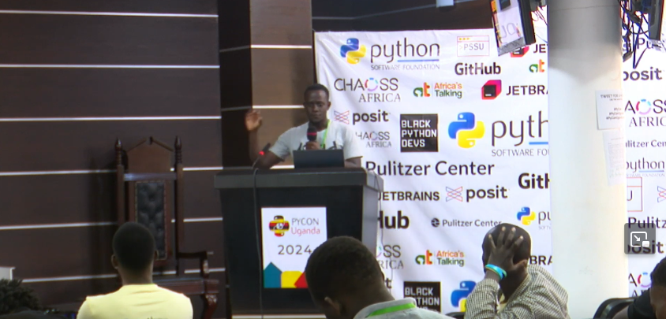

28th January, 2025
## Introduction
I am thrilled to share something special with you all! I had the incredible opportunity to speak at PyCon Uganda about one of my favorite topics: [Reflex](https://reflex.dev), a powerful framework for full-stack Python web development.

### Conclusion
My talk, titled **Full-Stack Python Web Development: Introducing Reflex**, was an amazing experience. I will be honest. I was pretty nervous stepping onto that stage, but I gave it my all, and I’m so proud of how it turned out.

In this talk, I dived into how Reflex simplifies building modern web applications using Python alone, and why I think it is a game-changer for developers.

**Check it out On Youtube**: [Full-Stack Python Web Development: Introducing Reflex](https://youtu.be/ht0Yn21wHn0?si=7na370fvVQHSKh-3)

